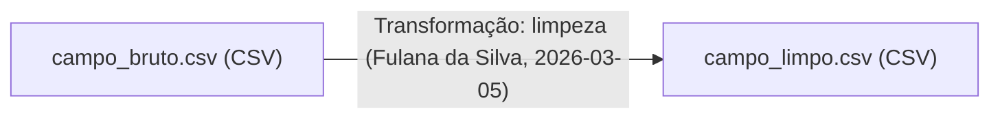

# Especificação — MyProvenance

Documento de especificação para implementação futura. Consolida as decisões tomadas na grilling session (`CONTEXT.md` e `docs/adr/`). Não substitui esses documentos — remeta a eles para o "porquê" de cada decisão; aqui está o "o quê" concreto para implementar.

Stack, empacotamento e segurança seguem `docs/Desenvolvimento.md` integralmente (SvelteKit + shadcn-svelte + Boxicons + TipTap, SQLite externo via `DB_PATH`, UUIDv7, Docker/GHCR, UNRAID). Conta é opcional — sem autenticação por padrão, ver ADR-0009 (revisa ADR-0002).

## 1. Visão geral

Ferramenta web para documentar a proveniência de conjuntos de dados de pesquisa. O usuário registra manualmente, via formulários, os eventos de Criação, Transformação e Análise de um dataset (nunca o dado em si — só metadados sobre ele). O histórico vira um **Registro de Proveniência**, sempre exportável como JSON (para backup/retomada) e como relatório `.md` com diagrama Mermaid. Por padrão (sem **Conta**), tudo roda no navegador, sem persistência no servidor — ver ADR-0009. Com **Conta**, os Registros e Agentes daquele usuário persistem no SQLite do servidor, isolados de outras contas.

Termos em **negrito** neste documento são os termos canônicos definidos em `CONTEXT.md`.

## 2. Modelo de dados

### 2.1 Registro de Proveniência

| Campo           | Tipo                             | Obrigatório             | Notas                                                                                     |
| --------------- | -------------------------------- | ----------------------- | ----------------------------------------------------------------------------------------- |
| `id`            | UUIDv7                           | sim                     | chave primária                                                                            |
| `titulo`        | texto                            | sim                     |                                                                                           |
| `descricao`     | texto rico (TipTap)              | não                     |                                                                                           |
| `status`        | enum: `rascunho` \| `finalizado` | sim                     | default `rascunho`; ver ADR-0003                                                          |
| `criadoEm`      | datetime                         | sim                     |                                                                                           |
| `finalizadoEm`  | datetime                         | não                     | preenchido só por ação explícita (botão "Finalizar"); export.json não finaliza (ADR-0010) |
| `schemaVersion` | inteiro                          | sim (no JSON exportado) | ver §4                                                                                    |

Sem **Conta**: só existe em memória no navegador (sem `usuarioId`, nunca grava no servidor). Com **Conta**: coluna `usuario_id` (FK para `usuarios.id`) escopa o Registro àquele usuário — ver §2.5 e ADR-0009.

### 2.2 Entidade

| Campo                  | Tipo                   | Obrigatório | Notas                                                                                        |
| ---------------------- | ---------------------- | ----------- | -------------------------------------------------------------------------------------------- |
| `id`                   | UUIDv7                 | sim         |                                                                                              |
| `registroId`           | UUIDv7                 | sim         | FK                                                                                           |
| `nome`                 | texto                  | sim         |                                                                                              |
| `descricao`            | texto                  | não         |                                                                                              |
| `formato`              | texto                  | não         | livre, com sugestões: CSV, TSV, XLSX, ODS, JSON, Parquet, GeoTIFF, Shapefile, GeoJSON        |
| `localizacao`          | texto (URL ou caminho) | não         | onde o dado real está guardado, fora da ferramenta                                           |
| `licenca`              | texto                  | não         | ex.: CC-BY 4.0, ou URL da licença                                                            |
| `geradaPorAtividadeId` | UUIDv7                 | sim         | toda Entidade nasce de exatamente 1 Atividade (Criação, Transformação, ou Análise com saída) |

### 2.3 Atividade

Campos comuns a todos os tipos:

| Campo              | Tipo                                            | Obrigatório | Notas                                         |
| ------------------ | ----------------------------------------------- | ----------- | --------------------------------------------- |
| `id`               | UUIDv7                                          | sim         |                                               |
| `registroId`       | UUIDv7                                          | sim         | FK                                            |
| `tipo`             | enum: `criacao` \| `transformacao` \| `analise` | sim         |                                               |
| `agenteId`         | UUIDv7                                          | sim         | FK para **Agente**                            |
| `dataHora`         | datetime                                        | sim         |                                               |
| `descricao`        | texto                                           | não         | descrição livre do que aconteceu              |
| `entidadesUsadas`  | lista de UUIDv7                                 | condicional | vazio em Criação; 1+ em Transformação/Análise |
| `entidadesGeradas` | lista de UUIDv7                                 | condicional | 1+ em Criação/Transformação; 0+ em Análise    |

Campos por tipo:

- **Criação** — `local` (texto/coordenadas, opcional), `instrumento` (marca/modelo, opcional).
- **Transformação** — `processo` (texto: script/código/passos), `parametros` (lista chave-valor livre), `ambienteExecucao` (`{ sistemaOperacional, pacotes: [{ nome, versao }] }`).
- **Análise** — `processo`, `ambienteExecucao` — mesmos campos de Transformação, ambos opcionais.

Regra de cardinalidade (ver `CONTEXT.md`): Criação gera 1+, usa 0. Transformação usa 1+, gera 1+. Análise usa 1+, gera 0+.

### 2.4 Agente

| Campo                  | Tipo                                          | Obrigatório | Notas                   |
| ---------------------- | --------------------------------------------- | ----------- | ----------------------- |
| `id`                   | UUIDv7                                        | sim         |                         |
| `nome`                 | texto                                         | sim         |                         |
| `tipo`                 | enum: `pessoa` \| `instituicao` \| `software` | sim         |                         |
| `afiliacao`            | texto                                         | não         |                         |
| `identificadorExterno` | texto                                         | não         | ORCID, RRID, ou similar |

Cadastro por **Conta** (isolado entre usuários — não é mais global), reutilizável entre Registros da mesma conta. Sem Conta, vive só na sessão anônima do navegador — ver `CONTEXT.md` e ADR-0009. Num Registro compartilhado (§2.6), cada coeditor continua escolhendo o Agente do seu próprio cadastro ao registrar uma Atividade — "Agentes envolvidos" no Detalhe do Registro exibe os Agentes de todas as Contas que já registraram Atividades ali, independente de quem está olhando.

### 2.5 Usuário (Conta) e Sessão

| Campo      | Tipo     | Obrigatório | Notas                                      |
| ---------- | -------- | ----------- | ------------------------------------------ |
| `id`       | UUIDv7   | sim         |                                            |
| `username` | texto    | sim         | único, 3-30 caracteres alfanuméricos + `_` |
| `pinHash`  | texto    | sim         | `scrypt` + salt, nunca exposto na API      |
| `pinSalt`  | texto    | sim         |                                            |
| `criadoEm` | datetime | sim         |                                            |

Sessão: token opaco (32 bytes aleatórios), hash guardado em `sessoes.token_hash`, cookie `httpOnly`/`secure`/`sameSite=lax`, expira em 30 dias com renovação a cada uso (sliding). Rate limit de 5 tentativas de PIN erradas por username bloqueia 15 min (em memória). Ver ADR-0009.

### 2.6 Papel de Acesso e Compartilhamento de edição

Um Registro pode ser compartilhado, entre Contas, para edição conjunta. Hierarquia de 3 papéis:

| Papel             | Título/descrição, Atividades/Entidades | Finalizar, Excluir, link público, gerenciar acesso | Sair do compartilhamento (remover a si mesmo) |
| ----------------- | :------------------------------------: | :------------------------------------------------: | :-------------------------------------------: |
| **Dono**          |                   ✅                   |                         ✅                         |                       —                       |
| **Administrador** |                   ✅                   |                         ✅                         |                      ✅                       |
| **Editor**        |                   ✅                   |                         ❌                         |                      ✅                       |

O Dono é sempre `registros.usuario_id` (o criador) e nunca aparece na tabela de compartilhamento —
não pode ser removido nem substituído (sem "transferência de dono"). Administrador tem paridade
total com o Dono, inclusive para compartilhar/remover outros usuários e ativar/desativar o link
público (§7-8). Editor fica restrito a conteúdo. Um Registro pode ter vários coeditores (papel
individual por usuário); compartilhar de novo com quem já tem acesso apenas atualiza o papel
(idempotente). Só existe para Registros com Conta — modo anônimo não tem esse conceito.

## 3. Esquema SQLite

```sql
CREATE TABLE usuarios (
  id TEXT PRIMARY KEY,
  username TEXT NOT NULL UNIQUE,
  pin_hash TEXT NOT NULL,
  pin_salt TEXT NOT NULL,
  criado_em TEXT NOT NULL
);

CREATE TABLE sessoes (
  token_hash TEXT PRIMARY KEY,
  usuario_id TEXT NOT NULL REFERENCES usuarios(id) ON DELETE CASCADE,
  criado_em TEXT NOT NULL,
  expira_em TEXT NOT NULL
);

-- usuario_id nullable: nao ha registro/agente sem Conta persistido no SQLite
-- (sem Conta, vive so no navegador) — obrigatoriedade e' da camada de aplicacao.
CREATE TABLE agentes (
  id TEXT PRIMARY KEY,
  usuario_id TEXT REFERENCES usuarios(id) ON DELETE CASCADE,
  nome TEXT NOT NULL,
  tipo TEXT NOT NULL CHECK (tipo IN ('pessoa','instituicao','software')),
  afiliacao TEXT,
  identificador_externo TEXT
);

CREATE TABLE registros (
  id TEXT PRIMARY KEY,
  usuario_id TEXT REFERENCES usuarios(id) ON DELETE CASCADE,
  titulo TEXT NOT NULL,
  descricao TEXT,
  status TEXT NOT NULL CHECK (status IN ('rascunho','finalizado')) DEFAULT 'rascunho',
  criado_em TEXT NOT NULL,
  finalizado_em TEXT,
  direcao_diagrama TEXT NOT NULL CHECK (direcao_diagrama IN ('LR','TD')) DEFAULT 'LR',
  token_compartilhamento TEXT  -- link publico de leitura; NULL = nao compartilhado; indice unico
);

-- Compartilhamento de edicao entre Contas (§2.6). Dono (registros.usuario_id) nunca aparece aqui.
CREATE TABLE registro_compartilhamentos (
  registro_id TEXT NOT NULL REFERENCES registros(id) ON DELETE CASCADE,
  usuario_id TEXT NOT NULL REFERENCES usuarios(id) ON DELETE CASCADE,
  papel TEXT NOT NULL CHECK (papel IN ('editor','administrador')),
  criado_em TEXT NOT NULL,
  PRIMARY KEY (registro_id, usuario_id)
);

CREATE TABLE atividades (
  id TEXT PRIMARY KEY,
  registro_id TEXT NOT NULL REFERENCES registros(id) ON DELETE CASCADE,
  tipo TEXT NOT NULL CHECK (tipo IN ('criacao','transformacao','analise')),
  agente_id TEXT NOT NULL REFERENCES agentes(id),
  data_hora TEXT NOT NULL,
  descricao TEXT,
  local TEXT,
  instrumento TEXT,
  processo TEXT,
  parametros TEXT,          -- JSON serializado
  ambiente_execucao TEXT    -- JSON serializado
);

CREATE TABLE entidades (
  id TEXT PRIMARY KEY,
  registro_id TEXT NOT NULL REFERENCES registros(id) ON DELETE CASCADE,
  nome TEXT NOT NULL,
  descricao TEXT,
  formato TEXT,
  localizacao TEXT,
  licenca TEXT,
  gerada_por_atividade_id TEXT NOT NULL REFERENCES atividades(id)
);

-- entidades usadas como entrada de uma atividade (N:N)
CREATE TABLE atividade_entidades_usadas (
  atividade_id TEXT NOT NULL REFERENCES atividades(id) ON DELETE CASCADE,
  entidade_id TEXT NOT NULL REFERENCES entidades(id),
  PRIMARY KEY (atividade_id, entidade_id)
);
```

`entidadesGeradas` de uma Atividade é obtido por consulta reversa (`SELECT id FROM entidades WHERE gerada_por_atividade_id = ?`, podendo retornar 0, 1 ou mais linhas) — evita FK circular entre as duas tabelas.

Regra de imutabilidade (ADR-0003): quando `registros.status = 'finalizado'`, a camada de aplicação bloqueia `UPDATE`/`DELETE` em `atividades` e `entidades` daquele `registro_id` — só `INSERT`. O próprio `registros.titulo`/`descricao` não é "histórico" (não faz parte da linhagem de proveniência) e continua editável em qualquer status. Exclusão do Registro inteiro (`DELETE FROM registros`, cascata) é sempre permitida, em qualquer status, mediante confirmação explícita na UI.

## 4. Formato do JSON exportado

Customizado, inspirado no vocabulário PROV, não PROV-JSON formal (ADR-0005). Campos em português (ADR-0007). Espelha 1:1 o modelo de dados do §2.

```json
{
	"schemaVersion": 2,
	"registro": {
		"id": "018f2f3a-...",
		"titulo": "Levantamento de espécies — Trilha do Ouro",
		"descricao": "<p>Coleta de campo 2026...</p>",
		"status": "finalizado",
		"criadoEm": "2026-03-01T10:00:00Z",
		"finalizadoEm": "2026-03-15T18:00:00Z"
	},
	"agentes": [
		{
			"id": "018f2f3b-...",
			"nome": "Fulana da Silva",
			"tipo": "pessoa",
			"afiliacao": "UFRJ",
			"identificadorExterno": "0000-0002-XXXX-XXXX"
		}
	],
	"entidades": [
		{
			"id": "018f2f3c-...",
			"nome": "campo_bruto.csv",
			"descricao": "Planilha de campo original",
			"formato": "CSV",
			"localizacao": "file:///dados/campo_bruto.csv",
			"licenca": "CC-BY 4.0",
			"geradaPorAtividadeId": "018f2f3d-..."
		}
	],
	"atividades": [
		{
			"id": "018f2f3d-...",
			"tipo": "criacao",
			"agenteId": "018f2f3b-...",
			"dataHora": "2026-03-01T09:00:00Z",
			"descricao": "Coleta de campo",
			"local": "-22.95, -43.20",
			"instrumento": "GPS Garmin eTrex 32x",
			"entidadesUsadas": [],
			"entidadesGeradas": ["018f2f3c-..."]
		}
	]
}
```

Upload (retomar): upsert por `registro.id` — se existe localmente, atualiza; se não, cria (ADR-0004).

## 5. Diagrama Mermaid

Gerado a partir do grafo de Entidades/Atividades de um Registro. Regras:

- Cada **Entidade** é um nó: `id["nome (formato)"]`.
- Cada Atividade que **gera** Entidades produz uma seta de cada Entidade **usada** para cada Entidade **gerada**, rotulada `tipo: descrição curta (Agente, data)`. Quando a Atividade usa e/ou gera mais de uma Entidade, a mesma seta/rótulo se repete para cada combinação entrada×saída (fan-out completo).
- **Criação** (sem entrada) aparece como nó sem seta de entrada — raiz da lineage.
- **Análise sem saída** não gera nó novo; não aparece no diagrama, só na tabela de Atividades do relatório (§6).
- Orientação (`LR`/`TD`) é uma preferência por Registro (`registros.direcao_diagrama`, padrão `LR`), alternável na tela de detalhe e respeitada tanto na renderização ao vivo quanto no relatório `.md` exportado (§6).

Exemplo:



## 6. Relatório `.md` exportado

Um único arquivo (`<slug-do-titulo>-provenance.md`), estrutura fixa:

1. **Cabeçalho** — título, descrição, status, data de exportação.
2. **Diagrama** — bloco ` ```mermaid ` do §5, na orientação persistida do Registro (`direcao_diagrama`).
3. **Entidades** — tabela: nome, formato, localização, licença.
4. **Linha do tempo de Atividades** — ordenada por `dataHora`: tipo, data/hora, Agente, Entidades usadas → Entidade gerada, campos específicos do tipo (local/instrumento; ou processo/parâmetros/ambiente de execução). Inclui Análises sem saída.
5. **Agentes envolvidos** — tabela: nome, tipo, afiliação.

## 7. Telas e fluxos

- **Lista de Registros** — rolagem infinita (sem paginação, per `Desenvolvimento.md`), busca por título, botão "Novo Registro", indicador de status (Rascunho/Finalizado); Registros compartilhados comigo (§2.6) aparecem junto com os próprios, com indicação de quem é o dono e meu papel. Sem Conta, lista vem da sessão local (sem rolagem infinita real — tudo já em memória).
- **Detalhe do Registro** — diagrama (renderizado ao vivo, não só no export, orientação persistida), lista de Entidades, linha do tempo de Atividades, botões "Editar" (título/descrição — permitido em qualquer status, não é "histórico"), "Adicionar Atividade" (3 formulários — Criação/Transformação/Análise), "Compartilhar" (com Conta, administrador+ — duas abas: link público de leitura e "Compartilhar com usuário" por username + papel Editor/Administrador, com lista de quem tem acesso e opção de remover/sair, §2.6/§8), "Finalizar" e "Excluir Registro" (administrador+), "Exportar JSON", "Exportar relatório .md". Cada Atividade tem botões "Editar" e "Excluir" quando o Registro está em Rascunho (tipo é imutável na edição; excluir remove também as Entidades que a Atividade gerou, bloqueado se alguma estiver em uso como entrada de outra Atividade).
- **Formulário de Atividade** — campos do §2.3; seletor de Entidade(s) usada(s) restrito às Entidades já existentes no Registro; seletor de Agente com autocomplete + atalho "novo Agente" inline.
- **Cadastro de Agentes** — lista com rolagem infinita, CRUD simples (Agente não pertence a um Registro, então não é afetado pelo status Rascunho/Finalizado do Registro).
- **Upload** — tela/ação para importar um JSON previamente baixado (upsert, §4) — local (Blob/FileReader) sem Conta, via `/registros/import` com Conta.
- **Link público de compartilhamento** (`/compartilhar/:token`) — somente leitura, sem sessão: mesmo diagrama/tabelas do Detalhe do Registro (sem botões de edição/exclusão), com export `.md`/JSON próprios. Token opaco de 24 bytes, revogável a qualquer momento pelo dono; só disponível para Registros com Conta (o modo anônimo não persiste no servidor, não há o que apontar um link para).
- **Entrar** / **Criar conta** — diálogos disponíveis no menu; "Criar conta" só aparece depois do primeiro Registro/Agente criado na sessão anônima. Criar conta migra tudo que estava na sessão local (ADR-0009).
- Banner fixo + aviso nativo do navegador (`beforeunload`) quando anônimo com dados não exportados.
- Tema claro/escuro, instalável como PWA (offline só leitura — ADR-0006).
- **Sobre** / **Como usar** — conteúdo estático, sem dados de domínio; o texto vem de Markdown em `src/lib/content/{sobre,como-usar}.{pt,en}.md`, renderizado para HTML sanitizado — editável direto no repositório, sem tocar em código.

## 8. Rotas (esboço, SvelteKit)

Todas as rotas de `/registros*` e `/agentes*` exigem sessão válida (cookie) — sem Conta, retornam 401 e o cliente nunca as chama (roda local, ADR-0009). Um Registro é acessível pelo Dono ou por qualquer papel compartilhado (§2.6); sem nenhum dos dois, retorna 404 (não vaza existência). Operações administrativas (Finalizar, Excluir, link público, gerenciar compartilhamento) exigem papel administrador+ mesmo para quem já enxerga o Registro como editor — ver anotações na tabela. Exceção: `/compartilhar/:token*` é pública (sem sessão) e só aceita `GET` — não há `PATCH`/`DELETE` nesse prefixo, em nenhuma rota.

| Rota                                     | Método       | Ação                                                                                            |
| ---------------------------------------- | ------------ | ----------------------------------------------------------------------------------------------- |
| `/auth/registrar`                        | POST         | cria Conta (username + PIN), loga, seta cookie                                                  |
| `/auth/entrar`                           | POST         | valida username + PIN (rate limited), loga                                                      |
| `/auth/sair`                             | POST         | encerra sessão                                                                                  |
| `/registros`                             | GET          | lista (rolagem infinita)                                                                        |
| `/registros`                             | POST         | cria Registro (rascunho)                                                                        |
| `/registros/:id`                         | GET          | detalhe (entidades + atividades + agentes envolvidos)                                           |
| `/registros/:id`                         | PATCH        | edita titulo/descricao (qualquer status, nao e' "historico"); editor+                           |
| `/registros/:id`                         | DELETE       | exclui Registro (cascata); administrador+                                                       |
| `/registros/:id/finalizar`               | POST         | rascunho → finalizado; administrador+                                                           |
| `/registros/:id/diagrama`                | PATCH        | altera `direcao_diagrama` (LR/TD, qualquer status); editor+                                     |
| `/registros/:id/compartilhar`            | POST         | ativa o link público (idempotente, mesmo token se já ativo); administrador+                     |
| `/registros/:id/compartilhar`            | DELETE       | desativa o link público (revoga o token); administrador+                                        |
| `/registros/:id/compartilhar-usuario`    | GET          | lista quem tem acesso (dono + coeditores, com papel); editor+                                   |
| `/registros/:id/compartilhar-usuario`    | POST         | compartilha por username + papel (idempotente); administrador+                                  |
| `/registros/:id/compartilhar-usuario`    | DELETE       | remove o acesso de um usuário; administrador+ remove qualquer um, qualquer coeditor sai sozinho |
| `/registros/:id/atividades`              | POST         | cria Atividade (+ Entidade gerada, se houver); editor+                                          |
| `/registros/:id/atividades/:atividadeId` | PATCH        | edita Atividade (so Rascunho, tipo imutavel, ADR-0003); editor+                                 |
| `/registros/:id/atividades/:atividadeId` | DELETE       | exclui Atividade + suas Entidades geradas (so Rascunho); editor+                                |
| `/registros/:id/export.json`             | GET          | baixa JSON (§4)                                                                                 |
| `/registros/:id/export.md`               | GET          | baixa relatório + diagrama (§6)                                                                 |
| `/registros/import`                      | POST         | upload de JSON (upsert, §4)                                                                     |
| `/compartilhar/:token`                   | GET          | pagina publica somente leitura (sem sessão, §7)                                                 |
| `/compartilhar/:token/export.json`       | GET          | baixa JSON publico (§4), nunca finaliza o Registro                                              |
| `/compartilhar/:token/export.md`         | GET          | baixa relatorio publico + diagrama (§6)                                                         |
| `/agentes`                               | GET/POST     | lista (rolagem infinita) / cria                                                                 |
| `/agentes/:id`                           | PATCH/DELETE | edita / remove                                                                                  |

Validação e sanitização de toda entrada segue `Desenvolvimento.md` §5. `UPDATE`/`DELETE` em `atividades`/`entidades` de um Registro `finalizado` retornam erro (ADR-0003). Sem Conta, a mesma validação (cardinalidade, sanitização) roda no cliente — módulos compartilhados em `src/lib/` (ADR-0009).

## 9. Referências

- `CONTEXT.md` — glossário (linguagem ubíqua).
- `docs/adr/0001` a `0009` — decisões arquiteturais e seus porquês.
- `docs/definicoes.md` — base conceitual (W3C PROV, FAIR).
- `docs/Desenvolvimento.md` — stack, empacotamento, segurança (não repetido aqui).
