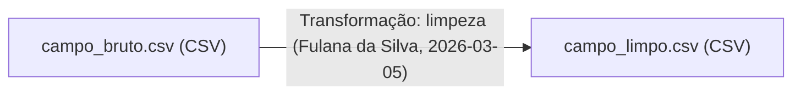

# Especificação — MyProvenance

Documento de especificação para implementação futura. Consolida as decisões tomadas na grilling session (`CONTEXT.md` e `docs/adr/`). Não substitui esses documentos — remeta a eles para o "porquê" de cada decisão; aqui está o "o quê" concreto para implementar.

Stack, empacotamento e segurança seguem `docs/Desenvolvimento.md` integralmente (SvelteKit + shadcn-svelte + Boxicons + TipTap, SQLite externo via `DB_PATH`, UUIDv7, Docker/GHCR, UNRAID, sem autenticação — ver ADR-0002).

## 1. Visão geral

Ferramenta web para documentar a proveniência de conjuntos de dados de pesquisa. O usuário registra manualmente, via formulários, os eventos de Criação, Transformação e Análise de um dataset (nunca o dado em si — só metadados sobre ele). O histórico vira um **Registro de Proveniência**: persistido no SQLite do servidor, exportável como JSON (para backup/retomada) e exportável como relatório `.md` com diagrama Mermaid.

Termos em **negrito** neste documento são os termos canônicos definidos em `CONTEXT.md`.

## 2. Modelo de dados

### 2.1 Registro de Proveniência

| Campo           | Tipo                             | Obrigatório             | Notas                                         |
| --------------- | -------------------------------- | ----------------------- | --------------------------------------------- |
| `id`            | UUIDv7                           | sim                     | chave primária                                |
| `titulo`        | texto                            | sim                     |                                               |
| `descricao`     | texto rico (TipTap)              | não                     |                                               |
| `status`        | enum: `rascunho` \| `finalizado` | sim                     | default `rascunho`; ver ADR-0003              |
| `criadoEm`      | datetime                         | sim                     |                                               |
| `finalizadoEm`  | datetime                         | não                     | preenchido na 1ª exportação ou ação explícita |
| `schemaVersion` | inteiro                          | sim (no JSON exportado) | ver §4                                        |

### 2.2 Entidade

| Campo                  | Tipo                   | Obrigatório | Notas                                                                                        |
| ---------------------- | ---------------------- | ----------- | -------------------------------------------------------------------------------------------- |
| `id`                   | UUIDv7                 | sim         |                                                                                              |
| `registroId`           | UUIDv7                 | sim         | FK                                                                                           |
| `nome`                 | texto                  | sim         |                                                                                              |
| `descricao`            | texto                  | não         |                                                                                              |
| `formato`              | texto                  | não         | livre, com sugestões: CSV, TSV, XLSX, ODS, JSON, Parquet, GeoTIFF, Shapefile, GeoJSON        |
| `localizacao`          | texto (URL ou caminho) | não         | onde o dado real está guardado, fora da ferramenta                                           |
| `licenca`              | texto                  | não         | ex.: CC-BY 4.0, ou URL da licença                                                            |
| `geradaPorAtividadeId` | UUIDv7                 | sim         | toda Entidade nasce de exatamente 1 Atividade (Criação, Transformação, ou Análise com saída) |

### 2.3 Atividade

Campos comuns a todos os tipos:

| Campo              | Tipo                                            | Obrigatório | Notas                                         |
| ------------------ | ----------------------------------------------- | ----------- | --------------------------------------------- |
| `id`               | UUIDv7                                          | sim         |                                               |
| `registroId`       | UUIDv7                                          | sim         | FK                                            |
| `tipo`             | enum: `criacao` \| `transformacao` \| `analise` | sim         |                                               |
| `agenteId`         | UUIDv7                                          | sim         | FK para **Agente**                            |
| `dataHora`         | datetime                                        | sim         |                                               |
| `descricao`        | texto                                           | não         | descrição livre do que aconteceu              |
| `entidadesUsadas`  | lista de UUIDv7                                 | condicional | vazio em Criação; 1+ em Transformação/Análise |
| `entidadesGeradas` | lista de UUIDv7                                 | condicional | 1+ em Criação/Transformação; 0+ em Análise    |

Campos por tipo:

- **Criação** — `local` (texto/coordenadas, opcional), `instrumento` (marca/modelo, opcional).
- **Transformação** — `processo` (texto: script/código/passos), `parametros` (lista chave-valor livre), `ambienteExecucao` (`{ sistemaOperacional, pacotes: [{ nome, versao }] }`).
- **Análise** — `processo`, `ambienteExecucao` — mesmos campos de Transformação, ambos opcionais.

Regra de cardinalidade (ver `CONTEXT.md`): Criação gera 1+, usa 0. Transformação usa 1+, gera 1+. Análise usa 1+, gera 0+.

### 2.4 Agente

| Campo                  | Tipo                                          | Obrigatório | Notas                   |
| ---------------------- | --------------------------------------------- | ----------- | ----------------------- |
| `id`                   | UUIDv7                                        | sim         |                         |
| `nome`                 | texto                                         | sim         |                         |
| `tipo`                 | enum: `pessoa` \| `instituicao` \| `software` | sim         |                         |
| `afiliacao`            | texto                                         | não         |                         |
| `identificadorExterno` | texto                                         | não         | ORCID, RRID, ou similar |

Cadastro global, reutilizável entre Registros (não pertence a um único Registro) — ver `CONTEXT.md`.

## 3. Esquema SQLite

```sql
CREATE TABLE agentes (
  id TEXT PRIMARY KEY,
  nome TEXT NOT NULL,
  tipo TEXT NOT NULL CHECK (tipo IN ('pessoa','instituicao','software')),
  afiliacao TEXT,
  identificador_externo TEXT
);

CREATE TABLE registros (
  id TEXT PRIMARY KEY,
  titulo TEXT NOT NULL,
  descricao TEXT,
  status TEXT NOT NULL CHECK (status IN ('rascunho','finalizado')) DEFAULT 'rascunho',
  criado_em TEXT NOT NULL,
  finalizado_em TEXT
);

CREATE TABLE atividades (
  id TEXT PRIMARY KEY,
  registro_id TEXT NOT NULL REFERENCES registros(id) ON DELETE CASCADE,
  tipo TEXT NOT NULL CHECK (tipo IN ('criacao','transformacao','analise')),
  agente_id TEXT NOT NULL REFERENCES agentes(id),
  data_hora TEXT NOT NULL,
  descricao TEXT,
  local TEXT,
  instrumento TEXT,
  processo TEXT,
  parametros TEXT,          -- JSON serializado
  ambiente_execucao TEXT    -- JSON serializado
);

CREATE TABLE entidades (
  id TEXT PRIMARY KEY,
  registro_id TEXT NOT NULL REFERENCES registros(id) ON DELETE CASCADE,
  nome TEXT NOT NULL,
  descricao TEXT,
  formato TEXT,
  localizacao TEXT,
  licenca TEXT,
  gerada_por_atividade_id TEXT NOT NULL REFERENCES atividades(id)
);

-- entidades usadas como entrada de uma atividade (N:N)
CREATE TABLE atividade_entidades_usadas (
  atividade_id TEXT NOT NULL REFERENCES atividades(id) ON DELETE CASCADE,
  entidade_id TEXT NOT NULL REFERENCES entidades(id),
  PRIMARY KEY (atividade_id, entidade_id)
);
```

`entidadesGeradas` de uma Atividade é obtido por consulta reversa (`SELECT id FROM entidades WHERE gerada_por_atividade_id = ?`, podendo retornar 0, 1 ou mais linhas) — evita FK circular entre as duas tabelas.

Regra de imutabilidade (ADR-0003): quando `registros.status = 'finalizado'`, a camada de aplicação bloqueia `UPDATE`/`DELETE` em `atividades` e `entidades` daquele `registro_id` — só `INSERT`. Exclusão do Registro inteiro (`DELETE FROM registros`, cascata) é sempre permitida, em qualquer status, mediante confirmação explícita na UI.

## 4. Formato do JSON exportado

Customizado, inspirado no vocabulário PROV, não PROV-JSON formal (ADR-0005). Campos em português (ADR-0007). Espelha 1:1 o modelo de dados do §2.

```json
{
	"schemaVersion": 2,
	"registro": {
		"id": "018f2f3a-...",
		"titulo": "Levantamento de espécies — Trilha do Ouro",
		"descricao": "<p>Coleta de campo 2026...</p>",
		"status": "finalizado",
		"criadoEm": "2026-03-01T10:00:00Z",
		"finalizadoEm": "2026-03-15T18:00:00Z"
	},
	"agentes": [
		{
			"id": "018f2f3b-...",
			"nome": "Fulana da Silva",
			"tipo": "pessoa",
			"afiliacao": "UFRJ",
			"identificadorExterno": "0000-0002-XXXX-XXXX"
		}
	],
	"entidades": [
		{
			"id": "018f2f3c-...",
			"nome": "campo_bruto.csv",
			"descricao": "Planilha de campo original",
			"formato": "CSV",
			"localizacao": "file:///dados/campo_bruto.csv",
			"licenca": "CC-BY 4.0",
			"geradaPorAtividadeId": "018f2f3d-..."
		}
	],
	"atividades": [
		{
			"id": "018f2f3d-...",
			"tipo": "criacao",
			"agenteId": "018f2f3b-...",
			"dataHora": "2026-03-01T09:00:00Z",
			"descricao": "Coleta de campo",
			"local": "-22.95, -43.20",
			"instrumento": "GPS Garmin eTrex 32x",
			"entidadesUsadas": [],
			"entidadesGeradas": ["018f2f3c-..."]
		}
	]
}
```

Upload (retomar): upsert por `registro.id` — se existe localmente, atualiza; se não, cria (ADR-0004).

## 5. Diagrama Mermaid

Gerado a partir do grafo de Entidades/Atividades de um Registro. Regras:

- Cada **Entidade** é um nó: `id["nome (formato)"]`.
- Cada Atividade que **gera** Entidades produz uma seta de cada Entidade **usada** para cada Entidade **gerada**, rotulada `tipo: descrição curta (Agente, data)`. Quando a Atividade usa e/ou gera mais de uma Entidade, a mesma seta/rótulo se repete para cada combinação entrada×saída (fan-out completo).
- **Criação** (sem entrada) aparece como nó sem seta de entrada — raiz da lineage.
- **Análise sem saída** não gera nó novo; não aparece no diagrama, só na tabela de Atividades do relatório (§6).

Exemplo:



## 6. Relatório `.md` exportado

Um único arquivo (`<slug-do-titulo>-provenance.md`), estrutura fixa:

1. **Cabeçalho** — título, descrição, status, data de exportação.
2. **Diagrama** — bloco ` ```mermaid ` do §5.
3. **Entidades** — tabela: nome, formato, localização, licença.
4. **Linha do tempo de Atividades** — ordenada por `dataHora`: tipo, data/hora, Agente, Entidades usadas → Entidade gerada, campos específicos do tipo (local/instrumento; ou processo/parâmetros/ambiente de execução). Inclui Análises sem saída.
5. **Agentes envolvidos** — tabela: nome, tipo, afiliação.

## 7. Telas e fluxos

- **Lista de Registros** — rolagem infinita (sem paginação, per `Desenvolvimento.md`), busca por título, botão "Novo Registro", indicador de status (Rascunho/Finalizado).
- **Detalhe do Registro** — diagrama (renderizado ao vivo, não só no export), lista de Entidades, linha do tempo de Atividades, botões "Adicionar Atividade" (3 formulários — Criação/Transformação/Análise), "Finalizar", "Exportar JSON", "Exportar relatório .md", "Excluir Registro".
- **Formulário de Atividade** — campos do §2.3; seletor de Entidade(s) usada(s) restrito às Entidades já existentes no Registro; seletor de Agente com autocomplete + atalho "novo Agente" inline.
- **Cadastro de Agentes** — lista com rolagem infinita, CRUD simples (Agente não pertence a um Registro, então não é afetado pelo status Rascunho/Finalizado do Registro).
- **Upload** — tela/ação para importar um JSON previamente baixado (upsert, §4).
- Tema claro/escuro, instalável como PWA (offline só leitura — ADR-0006).

## 8. Rotas (esboço, SvelteKit)

| Rota                         | Método       | Ação                                                  |
| ---------------------------- | ------------ | ----------------------------------------------------- |
| `/registros`                 | GET          | lista (rolagem infinita)                              |
| `/registros`                 | POST         | cria Registro (rascunho)                              |
| `/registros/:id`             | GET          | detalhe (entidades + atividades + agentes envolvidos) |
| `/registros/:id`             | DELETE       | exclui Registro (cascata)                             |
| `/registros/:id/finalizar`   | POST         | rascunho → finalizado                                 |
| `/registros/:id/atividades`  | POST         | cria Atividade (+ Entidade gerada, se houver)         |
| `/registros/:id/export.json` | GET          | baixa JSON (§4)                                       |
| `/registros/:id/export.md`   | GET          | baixa relatório + diagrama (§6)                       |
| `/registros/import`          | POST         | upload de JSON (upsert, §4)                           |
| `/agentes`                   | GET/POST     | lista (rolagem infinita) / cria                       |
| `/agentes/:id`               | PATCH/DELETE | edita / remove                                        |

Validação e sanitização de toda entrada segue `Desenvolvimento.md` §5. `UPDATE`/`DELETE` em `atividades`/`entidades` de um Registro `finalizado` retornam erro (ADR-0003).

## 9. Referências

- `CONTEXT.md` — glossário (linguagem ubíqua).
- `docs/adr/0001` a `0007` — decisões arquiteturais e seus porquês.
- `docs/definicoes.md` — base conceitual (W3C PROV, FAIR).
- `docs/Desenvolvimento.md` — stack, empacotamento, segurança (não repetido aqui).
